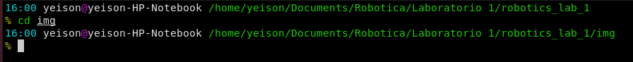
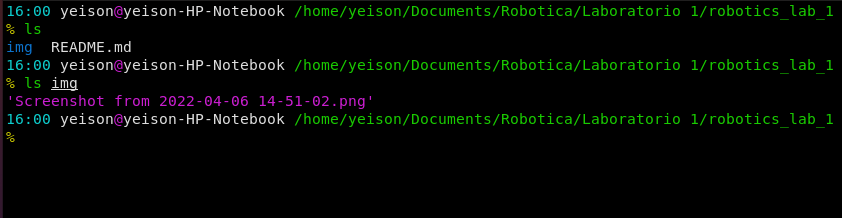
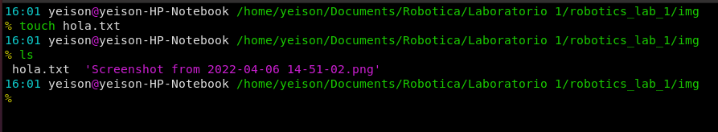
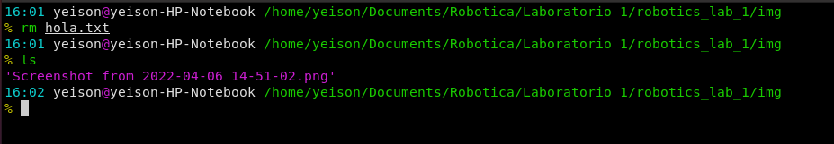
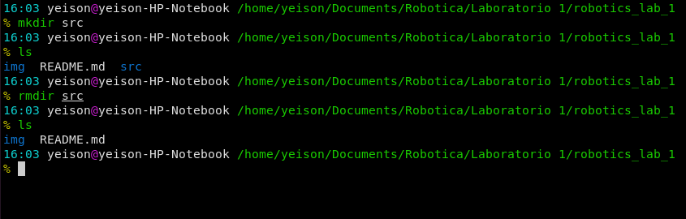
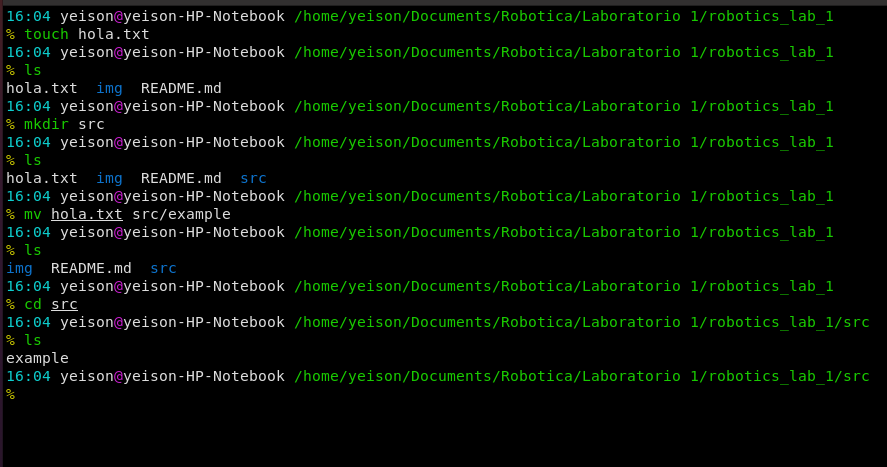
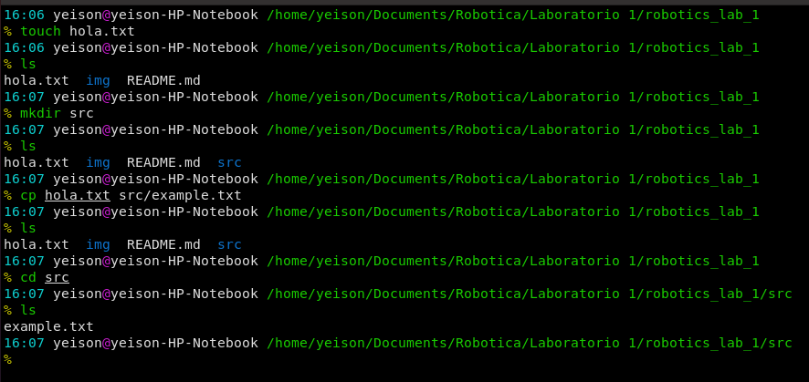
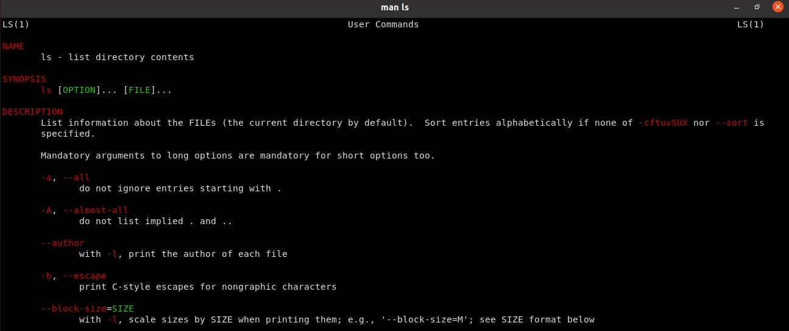
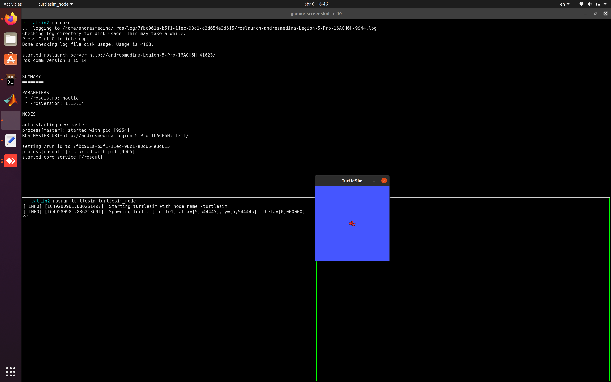
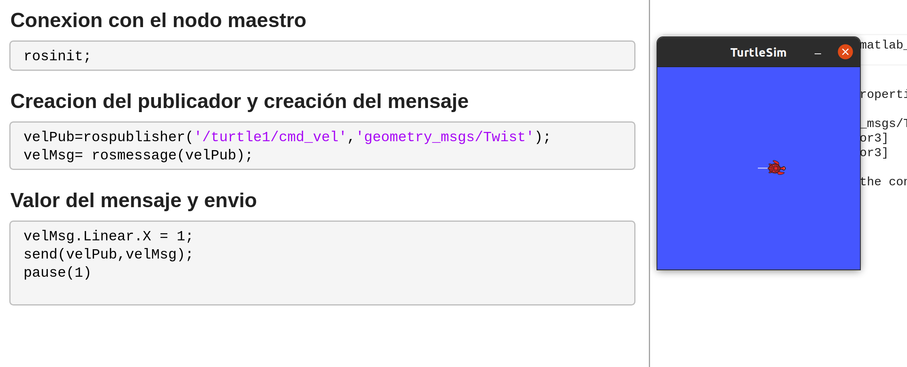

# robotics_lab_1
First laboratory in robotics course in the Universidad Nacional de Colombia, the laboratory ist composed by ROS basics and the conection with MATLAB and Python.
# Linux recommended commands

## pwd
With this command you can see the route from where you are.


## cd

This command will let you navigate through the folders in you enviroment 



## ls 

By his own will let you to see the folders and files in your current position. It can also show the ones of other routes.



## touch

This will allow you to create a file with the name you want. 



## rm 

This command will let you destroy a file.



## mkdir y rmdir

mkdir will let you to create a folder and rmdir to eliminate it. 



## mv 

The mv command let you move a file from the position you are, or the one you specified to another location and it also lets you change the name of the file.



## cp 

The cp command let you copy a file and as with mv rename it. 



## man 

This command is very important because it will give you all the information about the option you can use with a command, to fulfill your needs. 



# Conecting ROS with Matlab
## roscore
In first place we launch the ROS core and initialize the turtle example.



## Publishing with Matlab

For this example we will publish the velocity of the turtle in order to do this, we have to create the publisher, specifying the message type and then configuring the message to give it a value and send it. 



## Subscribing to a topic

For subscribe it is important to use the ```rossuscriber``` method giving it the topic and the message type, and in order to see the results, we can use the LatestMessage function. 

```matlab
posSubs = rossubscriber("/turtle1/pose",'turtlesim/Pose');
posSubs.LatestMessage
```

## Executing a service

For execute a service we use the ```rossvcclient``` function, passing the name of the service as a parameter. Then we create a message with the function ```rosmessage``` and define the parameters in its structure:
```
posServiceCliente = rossvcclient("/turtle1/teleport_absolute")
poseMsg = rosmessage(posServiceCliente)
poseMsg.X = 4
poseMsg.Y = 10
poseMsg.Theta = pi/2
```
It not necessary to define all parameters, just the ones we want to change. Finally we send the message to the service with ```call```:
```
posResp = call(posServiceCliente,poseMsg)
```
## Killing master node

To shutdown the ros network in matlab we use the command ```rosshutdown```.


